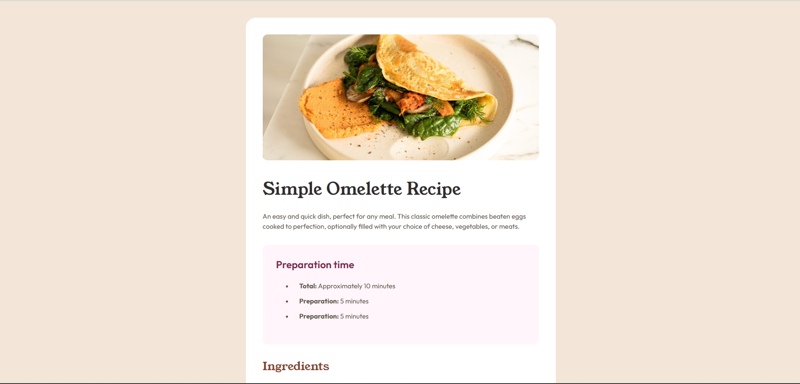

# Frontend Mentor - Blog preview card solution

This is a solution to the [Blog preview card challenge on Frontend Mentor](https://www.frontendmentor.io/challenges/blog-preview-card-ckPaj01IcS). Frontend Mentor challenges help you improve your coding skills by building realistic projects.

## Table of contents

- [Overview](#overview)
  - [The challenge](#the-challenge)
  - [Screenshot](#screenshot)
  - [Links](#links)
- [My process](#my-process)
  - [Built with](#built-with)
  - [Continued development](#continued-development)
  - [Useful resources](#useful-resources)
- [Author](#author)

## Overview

### The challenge

Users should be able to:

- See hover and focus states for all interactive elements on the page

### Screenshot

### Links

- Solution URL: [Add solution URL here](https://your-solution-url.com)
- Live Site URL: [Add live site URL here](https://your-live-site-url.com)

## My process

### Built with

- Semantic HTML5 markup
- CSS custom properties
- Flexbox

### Continued development

I want to be more fluent with responsiveness of the site. Basically I want it to be as responsive as possible. Also I want to improve in fonts, and overall font experience

### Useful resources

- [Claude AI](https://claude.ai/) - Amazing tool for AI help. Helped me a lot with responsiveness of the site
- [Space between bullets](https://stackoverflow.com/questions/4373046/css-control-space-between-bullet-and-li) - This article here helped me realize spacing between bullets and elements in lists
- [CSS Variables](https://www.w3schools.com/css/css3_variables.asp) - This article here helped me with css variables and :root component

## Author

- Frontend Mentor - [@ugljesaDotbog](https://www.frontendmentor.io/profile/ugljesaDotbog)
